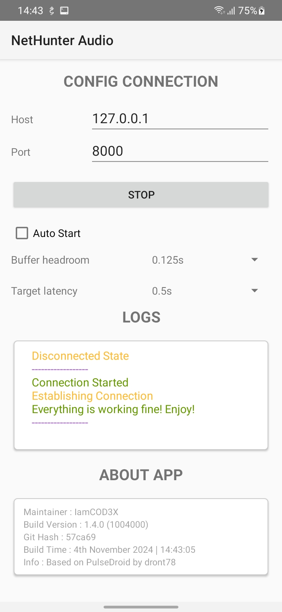
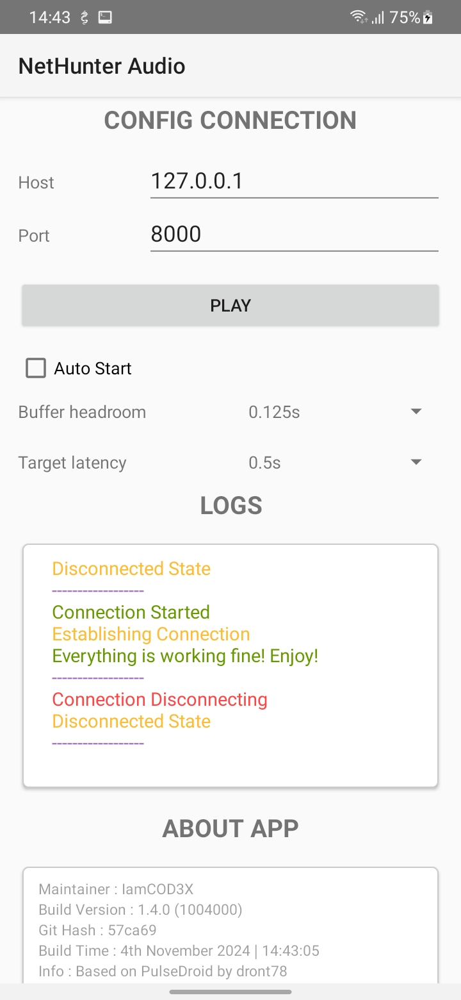
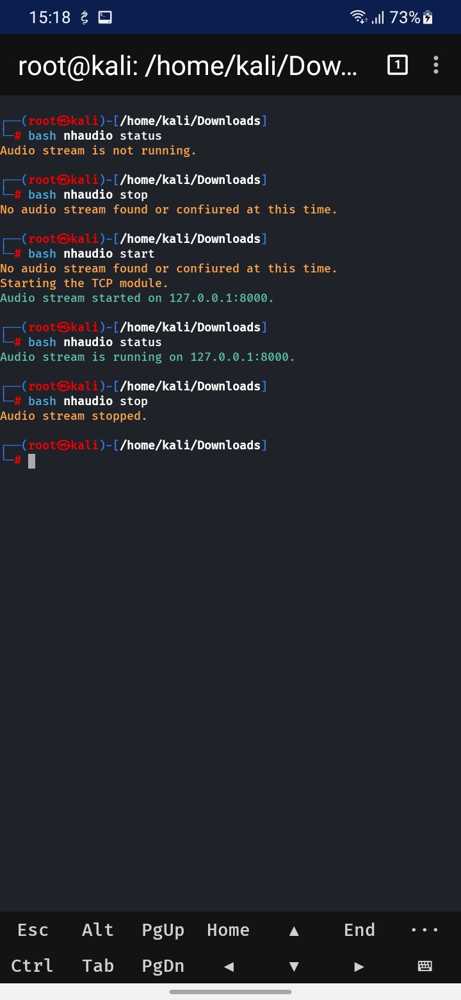

# Nethunter PulseAudio

This script allows you to start, stop, and check the status of a PulseAudio TCP stream on a specified IP address and port.
It's designed to route audio over TCP/IP from a Linux environment (such as Kali NetHunter) that uses PulseAudio, making it accessible on devices connected over a network (local host in this project).

## Features

- Starts and stops a PulseAudio TCP stream on chroot like Kali Nethunter.
- Configurable IP address, port, sample rate, format, and channels.
- Includes status checks to confirm if the stream is active.

## Requirements

- **Kali NetHunter**: Recommended environment for this script. [Learn more about Kali NetHunter here](https://www.kali.org/docs/nethunter/).
- **PulseAudio**: Ensure PulseAudio is installed and running on your Linux environment.
- **pactl**: Required for managing PulseAudio modules.
- **Basic Knowledge of Terminal Commands**

## Installation

1. **Install PulseAudio** (if not already installed):
   ```bash
   sudo apt-get update && sudo apt-get install -y pulseaudio
   ```

2. **Clone the repository**:
   ```bash
   git clone https://github.com/IamCOD3X/Nethunter_PulseAudio.git
   cd Nethunter_PulseAudio
   ```
   or 

   ```bash
   wget https://raw.githubusercontent.com/IamCOD3X/Nethunter_Audio/refs/heads/main/audio
   ```

3. **Move the script into `/usr/bin` for easy access**:
   ```bash
   mv audio /usr/bin && chmod +x /usr/bin/audio
   ```

4. **(Optional) Edit the Configuration**:
   Open the script in a text editor and adjust the configuration variables if needed:
   ```bash
   nano /usr/bin/audio
   ```
   - `PULSE_AUDIO_IP`: IP address for the TCP stream (default is `127.0.0.1`).
   - `PULSE_AUDIO_PORT`: Port number for the TCP stream (default is `8000`).
   - `PULSE_AUDIO_RATE`: Sample rate for the audio stream (default is `48000`).
   - `PULSE_AUDIO_FORMAT`: Audio format (default is `s16le`).
   - `PULSE_AUDIO_CHANNELS`: Number of audio channels (default is `2`).

## Usage

Run the script with one of the following commands:

```bash
audio {start|stop|status}
```

### Commands Overview

| Command | Description |
| ------- | ----------- |
| `start` | Starts PulseAudio (if not already running), and loads the TCP module to begin audio streaming. |
| `stop`  | Stops the audio stream by unloading the TCP module. If no other modules are running, PulseAudio will also be stopped. |
| `status`| Checks if the audio stream is active and displays its current status. |

### Command Details

#### Start Audio Streaming
To start the audio streaming, use the following command:
```bash
audio start
```
- This command will check if PulseAudio is running, start it if necessary, and load the TCP module for audio streaming.

#### Stop Audio Streaming
To stop the audio streaming, run:
```bash
audio stop
```
- This will unload the TCP module and stop PulseAudio if no other modules are in use.

#### Check Audio Stream Status
To check if the audio stream is running, use:
```bash
audio status
```
- This will display whether the audio stream is active along with any relevant error codes.

## How It Works

This script uses the `pactl` command to load and unload the `module-simple-protocol-tcp` module in PulseAudio. Here’s a breakdown of each function:

- **start_pulseaudio**: Checks if PulseAudio is running, and starts it if not.
- **start_stream**: Unloads any existing instances of the module to avoid conflicts, then loads the TCP module with specified parameters.
- **stop_stream**: Unloads the TCP module and stops PulseAudio if no other modules are loaded.
- **stream_status**: Checks if the TCP module is currently loaded to confirm if the stream is active.

## Troubleshooting

- **Failed to start PulseAudio**: Ensure PulseAudio is installed and working correctly by running `pulseaudio --version`.
- **No audio stream found**: If `status` reports that no stream is found, make sure the `start` command was successful and that PulseAudio is not being blocked by firewall rules or permissions.
- **Connection Issues**: Common errors may include connection failures. Refer to error messages for specific guidance.
  - Ensure network firewalls allow the specified port (default `8000`) for the audio stream.
  - Verify that PulseAudio is configured to accept TCP connections.

## Screenshots

To provide a visual reference for using the Nethunter PulseAudio script, here are some example screenshots:

### Nethuner Audio App

 

### Nethunter Terminal Usage

 

## License

This project is licensed under the MIT License. See the [LICENSE](LICENSE) file for details.
